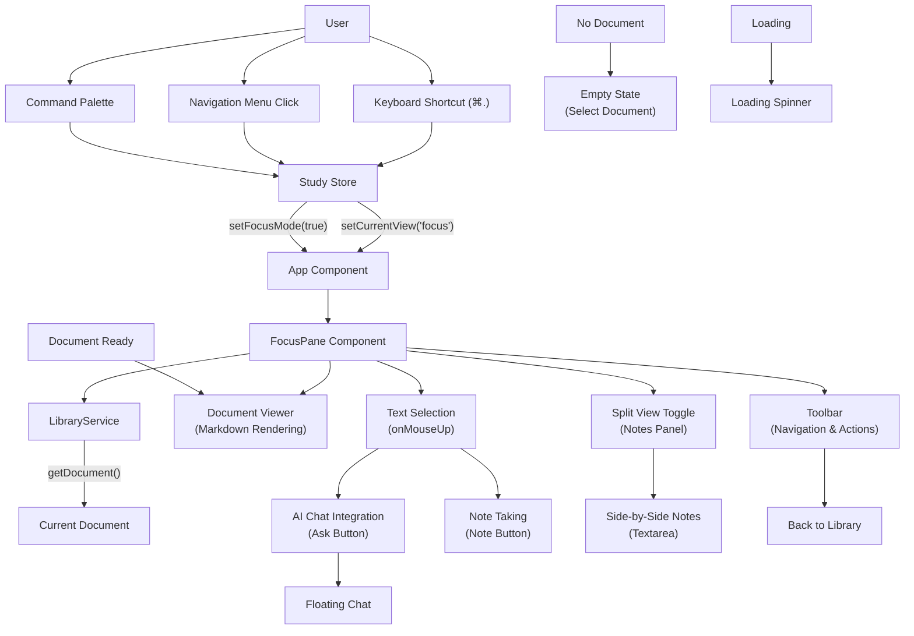

# Focus Mode Documentation

## Overview

Focus Mode is a distraction-free reading and study environment in Stellar that provides a clean, full-screen document viewing experience with integrated note-taking and AI assistance capabilities.

## Architecture



## Components

### FocusPane (`src/components/focus/focus-pane.tsx`)

The main component that handles document viewing in focus mode.

**Key Features:**
- Document loading and display
- Markdown rendering with basic HTML conversion
- Text selection detection
- Split-view toggle for note-taking
- AI chat integration
- Navigation controls

**State Management:**
```typescript
const [splitView, setSplitView] = useState(false)
const [selectedText, setSelectedText] = useState("")
const [currentDocument, setCurrentDocument] = useState<Document | null>(null)
const [isLoading, setIsLoading] = useState(false)
const [notes, setNotes] = useState("")
```

### NoteEditor (`src/components/focus/note-editor.tsx`)

A rich text editor for creating and editing notes with advanced features.

**Key Features:**
- Rich text editing with TipTap
- Auto-save functionality (2-second delay)
- Tag management system
- Document persistence
- Loading states

## Entry Points

Focus mode can be activated through multiple methods:

### 1. Keyboard Shortcut
- **Default**: `⌘.` (Command + period)
- **Customizable** through settings

### 2. Navigation Rail
- Click the Focus button (BookOpen icon) in the slim navigation rail

### 3. Command Palette
- Open with `⌘K` and search for "Focus Mode"

### 4. Programmatic
- Call `setCurrentView("focus")` from the study store

## State Management

Focus mode state is managed through Zustand store (`src/lib/study-store.ts`):

```typescript
interface StudyState {
  currentView: "focus" | "library" | "graph" | "workspace" | "history" | "settings" | "note-editor"
  focusMode: boolean
  currentDocument: string | null
  // ... other state properties
}
```

**Key State Properties:**
- `currentView`: Controls which view is active
- `focusMode`: Boolean flag for focus mode state
- `currentDocument`: ID of the currently selected document
- `showFloatingChat`: Controls AI chat visibility

## Document Handling

### Document Loading
```typescript
useEffect(() => {
  const loadDocument = async () => {
    if (!currentDocumentId) {
      setCurrentDocument(null)
      return
    }

    try {
      setIsLoading(true)
      const doc = await libraryService.getDocument(currentDocumentId)
      setCurrentDocument(doc)
    } catch (error) {
      console.error('Failed to load document:', error)
    } finally {
      setIsLoading(false)
    }
  }

  loadDocument()
}, [currentDocumentId])
```

### Document States
1. **No Document Selected**: Shows empty state with call-to-action
2. **Loading**: Displays loading spinner with progress indicator
3. **Document Ready**: Shows full document interface with content
4. **Error**: Displays error message with retry options

## Features

### Text Selection & AI Integration

**Text Selection Detection:**
```typescript
const handleTextSelection = () => {
  const selection = window.getSelection()
  if (selection && selection.toString().trim()) {
    setSelectedText(selection.toString())
  }
}
```

**AI Chat Integration:**
- Select text to reveal action buttons
- Click "Ask (?)" to open floating chat with context
- Selected text is automatically included in AI conversation

### Split View Note-Taking

**Toggle Split View:**
- Click the Split button in the toolbar
- Provides side-by-side document and notes interface
- Notes support markdown formatting

**Notes Panel:**
```typescript
{splitView && (
  <div className="w-1/2 flex flex-col">
    <div className="p-3 border-b">
      <h3 className="font-medium">Notes</h3>
    </div>
    <div className="flex-1 p-3">
      <Textarea
        placeholder="Take notes here... (markdown supported)"
        className="h-full resize-none border-0 focus-visible:ring-0"
        value={notes}
        onChange={(e) => setNotes(e.target.value)}
      />
    </div>
  </div>
)}
```

### Markdown Rendering

Basic markdown-to-HTML conversion for document display:

```typescript
const renderMarkdownContent = (content: string) => {
  const htmlContent = content
    .replace(/^# (.*$)/gim, '<h1 class="text-3xl font-bold mb-4 mt-6">$1</h1>')
    .replace(/^## (.*$)/gim, '<h2 class="text-2xl font-semibold mb-3 mt-5">$1</h2>')
    .replace(/^### (.*$)/gim, '<h3 class="text-xl font-medium mb-2 mt-4">$1</h3>')
    .replace(/^\* (.*$)/gim, '<li class="ml-4 mb-1">$1</li>')
    .replace(/\n\n/g, '</p><p class="mb-4">')
    .replace(/\n/g, '<br/>')

  return `<div class="prose prose-neutral dark:prose-invert max-w-none leading-relaxed"><p class="mb-4">${htmlContent}</p></div>`
}
```

### Toolbar Features

**Navigation & Metadata:**
- Back button to library
- Document title display
- Document type badge
- Character count indicator

**Actions:**
- Split view toggle
- Document metadata display

## UI Behavior

### Focus Mode Active
When focus mode is active:
- Context bar is hidden for distraction-free reading
- Focus mode indicator appears in top-right corner
- Full-screen document interface
- Keyboard shortcuts remain active

### Layout Changes
```typescript
// Context bar is hidden in focus mode
{!focusMode && (
  <div className="border-b border-border">
    <ContextBar />
  </div>
)}

// Focus pane takes full available space
<div className="overflow-hidden min-h-0 h-full">
  {currentView === "focus" ? <FocusPane /> : renderCurrentView()}
</div>
```

## Integration Points

### LibraryService
- Document retrieval: `getDocument(id)`
- Document management and persistence
- Error handling for missing documents

### Floating Chat
- Activated when text is selected and "Ask" is clicked
- Provides context-aware AI assistance
- Maintains conversation history

### Command Palette
- Quick navigation to focus mode
- Searchable actions and commands
- Keyboard-driven workflow

### Keyboard Shortcuts
- Global hotkey system with customizable bindings
- Focus mode toggle: `⌘.`
- Chat activation: `⇧Space`
- Command palette: `⌘K`

## Usage Patterns

### Typical Workflow
1. **Navigate to Library** → Select document
2. **Enter Focus Mode** → `⌘.` or click Focus button
3. **Read Document** → Scroll through content
4. **Select Text** → Highlight interesting passages
5. **Ask AI** → Click "Ask (?)" for explanations
6. **Take Notes** → Toggle split view for note-taking
7. **Navigate Back** → Return to library when done

### Advanced Features
- **Text Selection + AI**: Select complex passages for AI explanations
- **Split View Study**: Read and take notes simultaneously  
- **Keyboard Navigation**: Use shortcuts for efficient workflow
- **Document Switching**: Quick navigation between documents

## Technical Implementation

### Component Structure
```
src/components/focus/
├── index.ts              # Export declarations
├── focus-pane.tsx        # Main reading interface
└── note-editor.tsx       # Rich text note editor
```

### Dependencies
- **React**: Core framework with hooks
- **Zustand**: State management
- **LibraryService**: Document operations
- **TipTap**: Rich text editing (NoteEditor)
- **Lucide Icons**: UI iconography

### Performance Considerations
- **Lazy loading**: Documents loaded on demand
- **Text selection optimization**: Efficient DOM selection handling
- **Auto-save debouncing**: 2-second delay for note saving
- **Memory management**: Component cleanup on unmount

## Future Enhancements

### Planned Features
- **Advanced markdown parsing**: Full CommonMark support
- **Document annotations**: Persistent highlighting and comments
- **Export functionality**: PDF/markdown export options
- **Reading progress tracking**: Position and completion status
- **Collaborative features**: Shared notes and discussions

### Potential Improvements
- **Better text selection UX**: Enhanced selection indicators
- **Note organization**: Hierarchical note structure
- **Document search**: In-document text search
- **Reading statistics**: Time spent, words read, etc.
- **Offline support**: Local document caching

## Troubleshooting

### Common Issues

**Document not loading:**
- Check `currentDocument` state in study store
- Verify LibraryService connection
- Check browser console for errors

**Text selection not working:**
- Ensure `onMouseUp` handler is attached
- Check for conflicting event handlers
- Verify selection detection logic

**Split view issues:**
- Check `splitView` state toggle
- Verify CSS layout classes
- Ensure proper responsive behavior

### Debug Tools
- React DevTools for component state
- Zustand DevTools for store inspection
- Browser console for error logging
- Network tab for document loading issues
