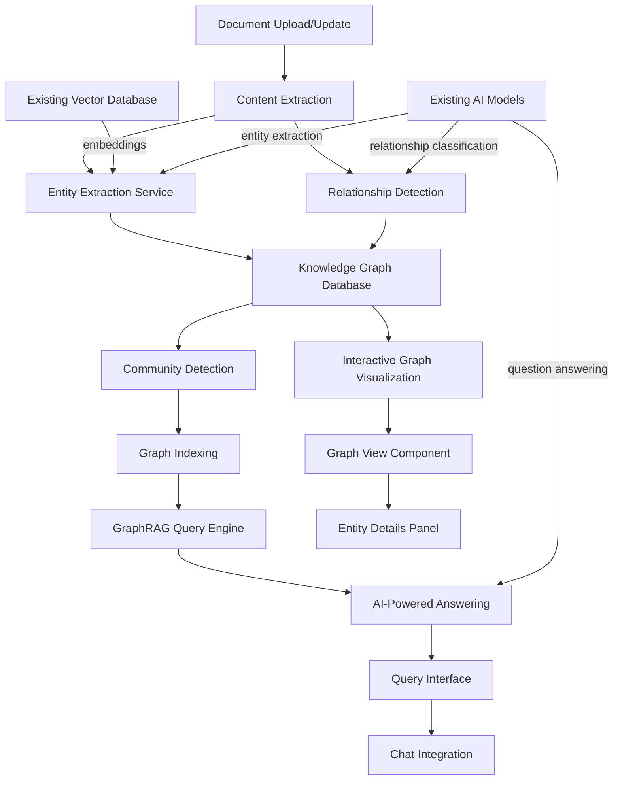

# GraphRAG Implementation Plan

## Overview

GraphRAG (Graph-based Retrieval Augmented Generation) will transform Stellar's current static graph view into an intelligent knowledge graph that automatically extracts entities, relationships, and concepts from your document collection, enabling complex queries and insights across your entire knowledge base.

## Architecture



## Implementation Phases

### Phase 1: Entity Extraction Service
**Timeline: 2-3 weeks**

#### Backend Implementation
Create new Rust module for knowledge graph management:

```rust
// src-tauri/src/graphrag/mod.rs
pub mod entity_extraction;
pub mod knowledge_graph;
pub mod graph_storage;
pub mod query_engine;

#[derive(Debug, Serialize, Deserialize, Clone)]
pub struct Entity {
    pub id: String,
    pub name: String,
    pub entity_type: EntityType,
    pub description: Option<String>,
    pub confidence: f32,
    pub document_mentions: Vec<DocumentMention>,
    pub embedding: Vec<f32>,
}

#[derive(Debug, Serialize, Deserialize, Clone)]
pub enum EntityType {
    Person,
    Organization,
    Location,
    Concept,
    Technology,
    Event,
    Topic,
}
```

#### Frontend Service
```typescript
// src/lib/services/graphrag-service.ts
export class GraphRAGService {
  private aiService: AIService
  private embeddingService: EmbeddingService
  
  async processDocument(document: Document): Promise<ProcessingResult> {
    // Extract entities using AI models
    const entities = await this.extractEntities(document)
    
    // Generate embeddings for entities
    const entitiesWithEmbeddings = await this.generateEntityEmbeddings(entities)
    
    // Store in knowledge graph
    await this.storeEntities(entitiesWithEmbeddings, document.id)
    
    return { entities: entitiesWithEmbeddings, relationships: [] }
  }
}
```

### Phase 2: Relationship Detection
**Timeline: 2-3 weeks**

#### Relationship Classification
```rust
#[derive(Debug, Serialize, Deserialize, Clone)]
pub struct Relationship {
    pub id: String,
    pub source_entity_id: String,
    pub target_entity_id: String,
    pub relationship_type: RelationshipType,
    pub confidence: f32,
    pub evidence: Vec<String>,
    pub created_at: DateTime<Utc>,
}

#[derive(Debug, Serialize, Deserialize, Clone)]
pub enum RelationshipType {
    RelatedTo,
    PartOf,
    InfluencedBy,
    SimilarTo,
    OpposedTo,
    CausedBy,
    UsedBy,
    DefinedBy,
}
```

#### Relationship Detection Algorithm
```typescript
async findRelationships(entities: Entity[]): Promise<Relationship[]> {
  const relationships: Relationship[] = []
  
  for (const entity1 of entities) {
    for (const entity2 of entities) {
      if (entity1.id === entity2.id) continue
      
      // Use embedding similarity
      const similarity = await this.calculateSimilarity(
        entity1.embedding, 
        entity2.embedding
      )
      
      if (similarity > 0.7) {
        // Classify relationship using AI
        const relationType = await this.classifyRelationship(entity1, entity2)
        
        relationships.push({
          source: entity1.id,
          target: entity2.id,
          type: relationType,
          confidence: similarity,
          evidence: await this.findEvidence(entity1, entity2)
        })
      }
    }
  }
  
  return relationships
}
```

### Phase 3: Graph Visualization
**Timeline: 3-4 weeks**

#### Replace Current Graph View
```typescript
// src/components/home/graphrag-view.tsx
import * as d3 from 'd3'
import { ForceGraphData, GraphNode, GraphLink } from './types'

export function GraphRAGView() {
  const [graphData, setGraphData] = useState<ForceGraphData>()
  const [selectedEntity, setSelectedEntity] = useState<Entity>()
  const [searchQuery, setSearchQuery] = useState('')
  const [filters, setFilters] = useState<GraphFilters>({
    entityTypes: [],
    relationshipTypes: [],
    minConfidence: 0.5
  })
  
  return (
    <div className="h-full flex">
      {/* Main Graph */}
      <div className="flex-1 relative">
        <D3ForceGraph
          data={graphData}
          onNodeClick={handleNodeClick}
          onNodeHover={handleNodeHover}
          filters={filters}
        />
        
        {/* Graph Controls */}
        <div className="absolute top-4 left-4 flex gap-2">
          <Button onClick={resetZoom}>Reset View</Button>
          <Button onClick={exportGraph}>Export</Button>
          <Button onClick={togglePhysics}>Toggle Physics</Button>
        </div>
      </div>
      
      {/* Side Panel */}
      <div className="w-80 border-l flex flex-col">
        <GraphSearchPanel 
          onSearch={handleSearch}
          onFilterChange={setFilters}
        />
        
        {selectedEntity && (
          <EntityDetailsPanel entity={selectedEntity} />
        )}
      </div>
    </div>
  )
}
```

#### D3.js Force Graph Implementation
```typescript
// src/components/home/graphrag/d3-force-graph.tsx
export function D3ForceGraph({ data, onNodeClick, filters }: Props) {
  const svgRef = useRef<SVGSVGElement>(null)
  
  useEffect(() => {
    if (!data || !svgRef.current) return
    
    const svg = d3.select(svgRef.current)
    
    // Create force simulation
    const simulation = d3.forceSimulation(data.nodes)
      .force("link", d3.forceLink(data.links).id(d => d.id))
      .force("charge", d3.forceManyBody().strength(-300))
      .force("center", d3.forceCenter(width / 2, height / 2))
    
    // Render nodes and links
    const link = svg.selectAll(".link")
      .data(data.links)
      .enter().append("line")
      .attr("class", "link")
      .style("stroke", d => getRelationshipColor(d.type))
      .style("stroke-width", d => Math.sqrt(d.confidence * 5))
    
    const node = svg.selectAll(".node")
      .data(data.nodes)
      .enter().append("g")
      .attr("class", "node")
      .call(d3.drag())
      .on("click", onNodeClick)
    
    // Add node visuals
    node.append("circle")
      .attr("r", d => Math.sqrt(d.mentions.length) * 5)
      .style("fill", d => getEntityColor(d.type))
    
    node.append("text")
      .text(d => d.name)
      .attr("dx", 12)
      .attr("dy", ".35em")
    
    simulation.on("tick", () => {
      link
        .attr("x1", d => d.source.x)
        .attr("y1", d => d.source.y)
        .attr("x2", d => d.target.x)
        .attr("y2", d => d.target.y)
      
      node.attr("transform", d => `translate(${d.x},${d.y})`)
    })
  }, [data, filters])
  
  return <svg ref={svgRef} className="w-full h-full" />
}
```

### Phase 4: Query Interface
**Timeline: 2-3 weeks**

#### GraphRAG Query Engine
```rust
// src-tauri/src/graphrag/query_engine.rs
impl QueryEngine {
    pub async fn query_graph(
        &self,
        question: &str,
        graph: &KnowledgeGraph,
        ai_service: &AIService,
    ) -> Result<QueryResult, GraphRAGError> {
        // 1. Parse question to identify query type
        let query_type = self.classify_query(question).await?;
        
        // 2. Find relevant entities and relationships
        let relevant_entities = self.find_relevant_entities(question, graph).await?;
        
        // 3. Build context from graph
        let context = self.build_graph_context(relevant_entities, graph).await?;
        
        // 4. Generate answer using AI
        let answer = ai_service.generate_answer(question, &context).await?;
        
        Ok(QueryResult {
            answer,
            relevant_entities,
            evidence: context.evidence,
            confidence: answer.confidence,
        })
    }
}
```

#### Query Interface Component
```typescript
// src/components/home/graphrag/query-interface.tsx
export function QueryInterface() {
  const [query, setQuery] = useState('')
  const [result, setResult] = useState<QueryResult>()
  const [loading, setLoading] = useState(false)
  const [queryHistory, setQueryHistory] = useState<string[]>([])
  
  const handleQuery = async () => {
    if (!query.trim()) return
    
    setLoading(true)
    try {
      const response = await graphragService.query(query)
      setResult(response)
      setQueryHistory(prev => [query, ...prev.slice(0, 9)])
    } catch (error) {
      console.error('Query failed:', error)
    } finally {
      setLoading(false)
    }
  }
  
  return (
    <div className="space-y-4">
      <div className="flex gap-2">
        <Input
          placeholder="Ask about your documents..."
          value={query}
          onChange={(e) => setQuery(e.target.value)}
          onKeyPress={(e) => e.key === 'Enter' && handleQuery()}
          className="flex-1"
        />
        <Button onClick={handleQuery} disabled={loading}>
          {loading ? <Loader2 className="h-4 w-4 animate-spin" /> : <Search className="h-4 w-4" />}
        </Button>
      </div>
      
      {result && (
        <QueryResultPanel 
          result={result}
          onEntityClick={handleEntityClick}
        />
      )}
      
      <QuerySuggestions 
        suggestions={getQuerySuggestions()}
        onSuggestionClick={setQuery}
      />
    </div>
  )
}
```

## Database Schema

### Knowledge Graph Tables
```sql
-- Entities table
CREATE TABLE knowledge_entities (
    id TEXT PRIMARY KEY,
    name TEXT NOT NULL,
    entity_type TEXT NOT NULL,
    description TEXT,
    confidence REAL NOT NULL,
    embedding BLOB,
    created_at DATETIME DEFAULT CURRENT_TIMESTAMP,
    updated_at DATETIME DEFAULT CURRENT_TIMESTAMP
);

-- Relationships table
CREATE TABLE knowledge_relationships (
    id TEXT PRIMARY KEY,
    source_entity_id TEXT NOT NULL,
    target_entity_id TEXT NOT NULL,
    relationship_type TEXT NOT NULL,
    confidence REAL NOT NULL,
    evidence TEXT, -- JSON array of text snippets
    created_at DATETIME DEFAULT CURRENT_TIMESTAMP,
    FOREIGN KEY (source_entity_id) REFERENCES knowledge_entities(id),
    FOREIGN KEY (target_entity_id) REFERENCES knowledge_entities(id)
);

-- Entity mentions in documents
CREATE TABLE entity_document_mentions (
    id TEXT PRIMARY KEY,
    entity_id TEXT NOT NULL,
    document_id TEXT NOT NULL,
    mention_text TEXT NOT NULL,
    position_start INTEGER,
    position_end INTEGER,
    context_snippet TEXT,
    FOREIGN KEY (entity_id) REFERENCES knowledge_entities(id),
    FOREIGN KEY (document_id) REFERENCES documents(id)
);

-- Community detection results
CREATE TABLE knowledge_communities (
    id TEXT PRIMARY KEY,
    name TEXT NOT NULL,
    description TEXT,
    entity_ids TEXT NOT NULL, -- JSON array of entity IDs
    coherence_score REAL NOT NULL,
    created_at DATETIME DEFAULT CURRENT_TIMESTAMP
);
```

## Integration Points

### 1. Document Processing Pipeline
```typescript
// Extend existing document upload to include GraphRAG processing
const handleDocumentUpload = async (file: File, categoryId: string) => {
  // Existing processing
  const document = await libraryService.uploadDocument(file, categoryId)
  
  // NEW: GraphRAG processing
  await graphragService.processDocument(document)
  
  // Update graph visualization
  await refreshGraphView()
}
```

### 2. AI Chat Integration
```typescript
// Enhance chat with graph context
const handleChatMessage = async (message: string) => {
  // Check if message benefits from graph context
  const needsGraphContext = await graphragService.analyzesQuery(message)
  
  if (needsGraphContext) {
    // Get relevant entities and relationships
    const graphContext = await graphragService.getRelevantContext(message)
    
    // Include in chat context
    const enhancedMessage = `${message}\n\nGraph Context:\n${graphContext}`
    
    return await aiService.chat(enhancedMessage)
  }
  
  return await aiService.chat(message)
}
```

### 3. Search Enhancement
```typescript
// Enhance document search with entity-based results
const searchDocuments = async (query: string) => {
  // Traditional text search
  const textResults = await libraryService.searchDocuments(query)
  
  // GraphRAG entity search
  const entityResults = await graphragService.searchByEntities(query)
  
  // Combine and rank results
  return combineSearchResults(textResults, entityResults)
}
```

## User Experience

### Query Examples
- **Conceptual**: "What are the main themes connecting my research papers?"
- **Relational**: "Which documents mention both 'machine learning' and 'ethics'?"
- **Temporal**: "How has my understanding of AI evolved over time?"
- **Comparative**: "What are the differences between the approaches in these papers?"

### Graph Interactions
- **Node Selection**: Click entities to see details and connections
- **Path Finding**: Show shortest path between two concepts
- **Community View**: Zoom into related concept clusters
- **Timeline**: Show entity evolution over document creation time

## Performance Considerations

### Optimization Strategies
1. **Incremental Processing**: Only process new/changed documents
2. **Caching**: Cache frequently accessed graph queries
3. **Lazy Loading**: Load graph sections on demand
4. **Background Processing**: Process large documents asynchronously

### Scaling Approach
```typescript
// Process documents in batches
const processBatch = async (documents: Document[]) => {
  const batchSize = 10
  for (let i = 0; i < documents.length; i += batchSize) {
    const batch = documents.slice(i, i + batchSize)
    await Promise.all(batch.map(doc => graphragService.processDocument(doc)))
  }
}
```

## Testing Strategy

### Unit Tests
- Entity extraction accuracy
- Relationship classification
- Query engine responses
- Graph visualization components

### Integration Tests
- Document processing pipeline
- AI model integration
- Database operations
- Frontend-backend communication

### User Acceptance Tests
- Query response quality
- Graph visualization usability
- Performance with large document sets
- Mobile responsiveness

## Migration Plan

### Phase 1: Parallel Development
- Build GraphRAG alongside existing graph view
- Use feature flag to toggle between implementations
- Test with subset of documents

### Phase 2: Gradual Rollout
- Enable for new documents first
- Process existing documents in background
- Provide migration status indicator

### Phase 3: Full Replacement
- Replace static graph view
- Archive old implementation
- Update documentation and tutorials

## Success Metrics

### Technical Metrics
- Entity extraction accuracy: >85%
- Relationship classification precision: >80%
- Query response time: <3 seconds
- Graph visualization performance: 60fps

### User Metrics
- Query usage frequency
- Graph interaction time
- Document discovery rate
- User satisfaction scores

## Risks and Mitigation

### Technical Risks
1. **AI Model Costs**: Implement caching and batch processing
2. **Performance**: Use incremental processing and optimization
3. **Complexity**: Phase implementation and thorough testing

### User Experience Risks
1. **Learning Curve**: Provide tutorials and examples
2. **Information Overload**: Implement progressive disclosure
3. **Accuracy Concerns**: Show confidence scores and allow corrections

## Future Enhancements

### Advanced Features
- **Temporal Analysis**: Show how concepts evolve over time
- **Collaborative Graphs**: Share knowledge graphs with others
- **Auto-Summarization**: Generate summaries of document clusters
- **Recommendation Engine**: Suggest related reading based on graph
- **Export Capabilities**: Export graphs to various formats

### Research Integrations
- **Citation Networks**: Import and visualize citation relationships
- **External Knowledge**: Link to external knowledge bases
- **Multi-modal**: Support images, videos, and audio content
- **Real-time Updates**: Live updates as documents are added

This implementation will transform Stellar from a document management tool into an intelligent knowledge discovery platform, making it uniquely valuable for researchers, students, and knowledge workers. 